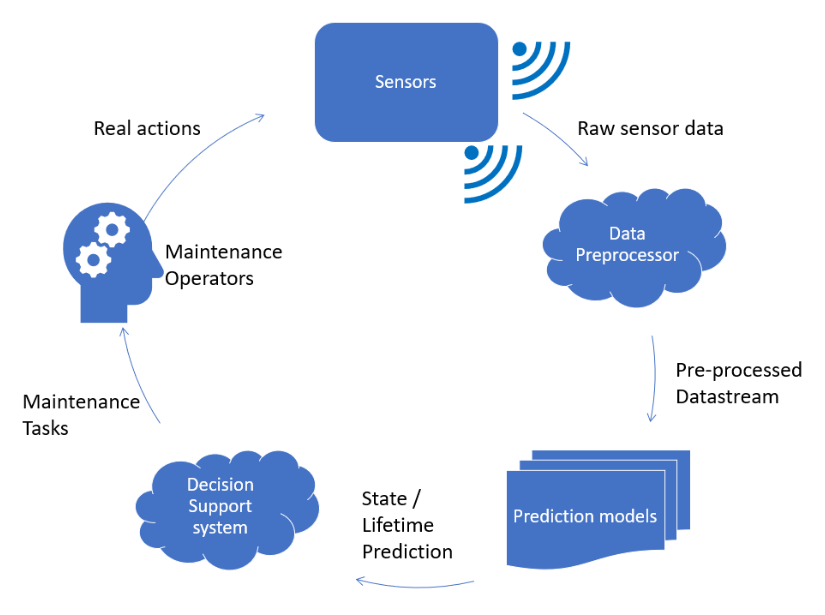

# Revolutionizing Railway Maintenance: The Integration of Large Language Models with Retrieval-Augmented Generation Systems
## Abstract
This article explores the transformative potential of Large Language Models (LLMs) in enhancing smart maintenance in the railway industry, marking a significant step towards Industry 4.0. The integration of advanced technologies into maintenance practices is crucial for improving operational efficiency, reliability, and reducing downtime. Smart maintenance, employing predictive analytics, quality control, and extensive monitoring, utilizes the Internet of Things (IoT), artificial intelligence (AI), and real-time data analytics. The advent of LLMs, such as ChatGPT, introduces a significant shift, automating decision-making and offering expert guidance to improve maintenance operations. Combining LLMs with Local Knowledge Bases (LKBs) through Retrieval-Augmented Generation (RAG) systems customizes maintenance solutions for specific industrial requirements, closing the gap between generic AI capabilities and domain-specific needs. This article discusses the design, implementation, and advantages of LLM-RAG systems in railway maintenance, highlighting their transformative impact on maintenance standards and ushering in a new era of operational excellence.

Keywords: Smart Maintenance, Large Language Models, Railway Industry, Industry 4.0, Artificial Intelligence, Predictive Maintenance, Retrieval-Augmented Generation

## 1. Introduction
In today's railway industry, smart maintenance—employing predictive analytics, quality control, and extensive monitoring—represents the integration of advanced technologies with maintenance practices to enhance operational efficiency, reliability, and minimize downtime. Utilizing IoT, AI, and real-time analytics, smart maintenance systems automate the monitoring, diagnosis, and management of machinery health. These systems are pivotal for predictive maintenance, ensuring machinery reliability, forecasting and diagnosing equipment issues, reducing maintenance costs, and improving production efficiency and quality (Lee, Wu, Zhao, & Ghaffari, 2014; Zhang & Li, 2022).

The increasing complexity and variety of machinery underscore the need for skilled engineers to manage operational data and systems (Ren, Verma, Li, & Teuwen, 2021). Advanced sensor technologies have significantly increased the volume of operational data, challenging traditional manual analysis methods. Recent AI advancements have revolutionized maintenance, automating data analysis, and fostering decision-making capabilities that significantly advance smart maintenance (Erdogan, Altuntas, & Dereli, 2022; Alaka et al., 2019; Wang, Li, & Ren, 2023).

Despite AI's strides in predictive maintenance, reliance on specialized engineers for comprehensive equipment care persists, presenting training and labor cost challenges. The introduction of Large Language Models (LLMs) like ChatGPT offers potential for enhancing smart maintenance systems by automating complex decisions and providing expert guidance, potentially reducing labor costs and improving efficiency (Zhou et al., 2023; Cao et al., 2023; Ouyang et al., 2022).

Wang and Li's research on integrating LLMs with Local Knowledge Bases (LKBs) represents a significant advancement in LLM application within maintenance. By embedding LLMs with localized, industry-specific insights, this integrative approach seeks to empower LLMs with the nuanced technical knowledge necessary for addressing specialized tasks in industrial maintenance. Their study offers a comprehensive framework that promotes automated, accurate systems that adapt to technological and industry changes. (Wang & Li, 2023).

As we proceed, Section 2 will discuss smart maintenance's development and importance within the Industry 4.0 paradigm, focusing on predictive maintenance. Section 3 will examine the role of LLMs and LKB integration in improving industrial maintenance, detailing Retrieval-Augmented Generation (RAG) systems' architecture. Section 4 will eview LLM-RAG systems' application in railway smart maintenance, highlighting their potential to transform maintenance practices by combining LLM capabilities with domain-specific knowledge. Finally, Section 5 will  explore future directions, including technological advancements, broader application areas, and integrating new technologies' challenges.

## 2. Smart Maintenance
Smart maintenance, fueled by Industry 4.0 and Maintenance 4.0 innovations, revolutionizes the industrial sector. Industry 4.0 signifies the automation and data exchange trend in manufacturing, integrating technologies like cyber-physical systems, the Internet of Things (IoT), cloud computing, and cognitive computing. Maintenance 4.0 applies these technologies to maintenance, introducing systems with self-learning, predictive analysis, diagnostics, and automated actions. Kans and Galar (2017) describe smart maintenance as a subset of smart systems with these capabilities, crucial for enhancing sustainability, energy efficiency, and reducing emissions, aligning with global sustainability goals (Samferdselsdepartement, 2015).

### The Smart Maintenance Lifecycle
Zenisek et al. (2017) outline the smart maintenance lifecycle from data acquisition, mainly from sensors, through cloud processing, to predicting maintenance needs. A cloud-based decision system analyzes this data, using hierarchical rules to identify and prioritize maintenance tasks. Maintenance personnel are then informed through interfaces like tablets and augmented reality glasses, completing the smart maintenance cycle.

*Figure 1. Smart Maintenance Lifecycle (Zenisek et al., 2017). This figure illustrates the process from data acquisition to maintenance action, highlighting the integration of cloud processing and decision support systems.*

### Evolution and Strategies of Maintenance

Maintenance strategies have evolved with smart maintenance, transitioning from traditional to data-driven methods. This evolution, depicted in Figure 2, distinguishes between preventive (before failure) and corrective (after failure) maintenance.

- **Preventive Maintenance**: This strategy is further divided into two sub-categories:
    - **Predetermined Maintenance**: Follows a set schedule based on time or usage, ignoring equipment's actual condition.
    - **Condition-Based Maintenance**: Monitors equipment for degradation signs to determine maintenance timing. Includes:
        - **Predictive Maintenance**: Uses data analytics to forecast failures, scheduling maintenance to minimize downtime and extend equipment life.
        - **Non-Predictive Condition-Based Maintenance**: Acts on current condition indicators without predicting future degradation.
- **Corrective Maintenance**: Repairs or replaces failed equipment, typically more costly and resulting in higher downtime due to lack of prior planning.

*Figure 2. Development of Maintenance Strategies (Standard Norge, 2017). This figure classifies maintenance strategies into smart (preventive) and traditional (corrective) methods, highlighting the progressive nature of maintenance in the context of Industry 4.0.*

This shift towards predictive, proactive, and self-maintenance strategies marks a significant change to anticipatory and intelligence-driven practices, key for improving machine uptime, reducing costs, and extending equipment life (Hai Qiu & Lee, University of Cincinnati; Hoftun, 2017).

### The P-F Curve in Predictive Maintenance

Predictive maintenance relies on the P-F (Potential Failure to Functional Failure) curve for scheduling maintenance activities to prevent failures, ensuring uninterrupted operations and reducing unexpected downtime risk. The P-F curve is crucial for visualizing an asset's degradation over time and determining the best time for intervention.

*Figure 3. An example of P-F Curve in Predictive Maintenance. This figure illustrates the stages of asset condition over time, emphasizing the importance of early detection and maintenance to prevent functional failure.*

- **Stage 1: Microscopic Damage** — Initially, damage is microscopic, with the asset operational and a low failure risk. Continuous monitoring is advised, though early wear may be undetectable by most sensors.
- **Stage 2: Visible Wear** — Wear becomes noticeable, detectable by some monitoring techniques. Scheduling repairs during the next maintenance period is advisable, with a low to moderate failure risk.
- **Stage 3: Advanced Deterioration** — Wear becomes substantial, detectable by most monitoring techniques, indicating a high failure risk. Immediate repairs, typically within a month, are necessary.
- **Stage 4: Severe Damage** — Damage is audible and visible, requiring immediate maintenance. The failure risk is very high, necessitating urgent intervention.

Smart maintenance techniques, including predictive analytics and continuous monitoring, enable early failure detection, enhancing asset availability and extending life. This approach aligns with Industry 4.0, focusing on informed decision-making. Integrating the P-F curve into maintenance strategy shifts from reactive to proactive maintenance, improving organizational efficiency and advancing towards Maintenance 4.0.

In summary, smart maintenance, emphasizing data analytics, sensor technology, and automation, transforms maintenance standards, promoting operational excellence. Addressing implementation challenges is crucial for leveraging smart maintenance in Industry 4.0. The contribution of LLMs to enhancing maintenance practices will be explored further.

## 3. LLM-RAG System

LLMs represent a significant breakthrough in natural language processing, characterized by their extensive parameters, sophisticated semantic comprehension, and advanced text generation capabilities. Through comprehensive training on wide-ranging textual datasets, LLMs capture the subtleties of language, enabling the production of high-quality natural language texts and effective communication with human users (Zhao et al., 2023). The evolution of LLMs is marked by the application of various enhancement techniques, including supervised fine-tuning, feedback bootstrap, and reinforcement learning from human feedback (Ouyang et al., 2022), which refine the model's capability to interpret human instructions accurately and produce relevant responses.

The rapid development of LLMs has seen significant contributions from research entities and corporations alike. For instance, OpenAI's progression with the GPT series has marked substantial achievements, with GPT-3.5 and GPT-4 notable for their dialogue comprehension and multi-modal information processing, respectively (OpenAI, 2023). Similarly, Anthropic's Claude series has demonstrated remarkable performance by leveraging the Transformer architecture and its self-attention mechanism for effective semantic comprehension and feature representation (Anthropic, 2023). These advancements underscore the LLMs' potential across various applications, including enhancing industrial systems' efficiency and intelligence through smart maintenance practices.

Integrating LLMs with a Local Knowledge Base (LKB) using RAG presents a formidable solution for imparting domain-specific expertise to LLMs, especially pertinent in the field of smart maintenance. This approach effectively counters the generalist nature of LLMs, which often lack specialized knowledge critical in sectors where data privacy and security are paramount (Li, Wang, & Sun, 2023).

*Figure 4: System Architecture of LLM-RAG, where the LLM is empowered by LKB (Wang & Li's, 2023).*

The architecture of the LLM-RAG, as depicted in Figure 4, represents a sophisticated integration aimed at augmenting LLMs with domain-specific knowledge through the utilization of a LKB. This system architecture is designed to address the gap between the generalist nature of LLMs and the specialized knowledge requirements of specific industrial domains. The process begins with the construction of a LKB by gathering vast amounts of private technical documents related to diverse industrial equipment and systems. This step is crucial for accumulating domain-specific knowledge that is typically beyond the reach of publicly trained LLMs (Johnson, Douze, & Jégou, 2021).

Following the knowledge base construction, the system employs a text reader capable of processing documents in various formats, including TXT, DOC, PDF, and CSV, ensuring that the rich information contained within these documents is accessible for analysis. To optimize the processing of this textual content, the information is segmented into smaller, semantically significant chunks using methods such as character-based splitting, token-based splitting, and recursive character-based splitting. This segmentation aims to maintain the semantic integrity of the text fragments, facilitating more effective analysis and interpretation by the LLM (Liu, Kusner, & Blunsom, 2020).

A critical step in the process is text vectorization, where text data is transformed into continuous vector representations through text embedding. This technique is pivotal for enabling the model to comprehend natural language by capturing the semantic information of the text, thus allowing for the association of texts with similar meanings. The use of large-scale pre-trained language models in text embedding methods has significantly enhanced their performance, offering a robust foundation for numerous NLP tasks like Natural Language Understanding, Semantic Search, and so on (Liu, Kusner, & Blunsom, 2020).

To manage the processing of large-scale local text data, the system leverages Facebook AI Similarity Search (FAISS) for efficient vector similarity calculation and search. FAISS provides a comprehensive suite of algorithms for large-scale vector retrieval, supporting parallel computing and vector quantization technology to enable swift search operations across extensive datasets. This capability is essential for identifying the most relevant content from the LKB in response to queries from operation and maintenance personnel (Johnson, Douze, & Jégou, 2021).

The system architecture culminates in the generation of prompts based on the relevant text and queries, which then guide the LLM in generating professional and reliable responses. By acting as the intermediary between users and the knowledge base, the LLM utilizes its language processing and semantic understanding capabilities to analyze, summarize, and reason through the provided contextual information, producing accurate and appropriate responses. This comprehensive approach underscores the importance of text embedding, vector similarity calculation, and prompt engineering as core components of the LLM-RAG system, demonstrating its potential to deliver expert-level insights and solutions in specialized industrial domains (Johnson, Douze, & Jégou, 2021; Liu, Kusner, & Blunsom, 2020).

Through the synergy between LLMs and LKBs, industries will significantly improve operational efficiency and maintenance standards. This integrated methodology not only aims at reducing operational and maintenance expenses but also enhances the reliability and safety of industrial equipment, marking a significant leap forward in applying AI in the industrial domain. Upcoming sections will explore practical research applications of LLM-RAG in the context of railway smart maintenance.

## 4. Advancements in Railway Maintenance: The Impact of LLM-RAG Integration

The integration of LLM-RAG systems offers a promising avenue for revolutionizing smart maintenance within the ambit of Industry 4.0. This innovative approach aims to address the gap in applying traditional LLMs directly to specialized industrial tasks, which stems from their training on broad, general knowledge bases rather than on domain-specific expertise necessary for smart manufacturing environments (Wang & Li, 2023; Lee & Su, 2023).

To mitigate this limitation and effectively leverage LLMs for smart maintenance, combining LLM capabilities with RAG systems has emerged as a key strategy. This entails augmenting LLMs with domain-specific knowledge through a dynamic retrieval mechanism, allowing the model to access and incorporate relevant information from a wide range of industrial data sources in real-time. Such a setup enriches LLMs' responses with in-depth, industry-specific insights, thus significantly enhancing their applicability in the domain of smart maintenance.

### The Role of LLM-RAG Systems in Smart Maintenance

Integrating smart maintenance with Large Language Models and Retrieval-Augmented Generation (LLM-RAG) represents a significant leap forward in the field of industrial operations. This sophisticated approach, particularly beneficial in areas such as predictive maintenance, quality control, prognostics, health management, and comprehensive monitoring, is adept at real-time processing of extensive structured and unstructured data. Such a capability is critical for detecting potential equipment failures early, crucially reducing unplanned downtime and refining maintenance schedules. The integration dramatically enhances the efficiency and cost-effectiveness of industrial operations. Through detailed analysis of a wide range of data—from sensor outputs and operational logs to technician notes and industry publications—smart maintenance systems equipped with LLM-RAG identify deviations and potential failure indicators early, enabling timely preventive actions.

Moreover, smart maintenance strategies, augmented by the integration of LLM-RAG, revolutionize maintenance approaches by ensuring interventions are both timely and precisely targeted, leading to maximized equipment uptime and extended life spans. These strategies leverage in-depth analysis of both historical and real-time data to recommend the most effective maintenance actions. Predictive insights allow for the scheduling of maintenance tasks during periods of minimal operational impact, optimizing resource allocation and minimizing disruption. This forward-thinking approach not only streamlines operations but also significantly enhances equipment reliability and longevity, marking a breakthrough in maintenance efficiency.

Furthermore, the integration of smart maintenance with LLM-RAG transforms how maintenance personnel interact with systems. By enabling complex queries through natural language processing, the integration allows for effortless communication, providing immediate, informed assistance for troubleshooting and repairs. Such intuitive interactions improve the understanding of maintenance issues, expedite decision-making processes, and lead to enhanced maintenance outcomes. The adaptive learning feature of the integrated system ensures that it becomes more accurate and effective with each interaction, continually improving the quality and reliability of maintenance practices. This innovative fusion of advanced data analysis and user-friendly interface places smart maintenance at the forefront of industrial technology, establishing new benchmarks for operational efficiency and equipment reliability.

### Practical Research Applications

In Wang & Li's (2023) research, a comparative investigation into the efficacy of LLM-RAG systems versus traditional LLM was conducted, focusing specifically on high-speed train (HST) maintenance. Through a detailed examination of responses to two targeted technical queries, they illuminated the profound disparity in response quality and applicability between the systems. The data presented in Table 1 vividly highlights the superior capability of LLM-RAG systems in navigating the complex, domain-specific demands inherent to HST maintenance.

Addressing the inquiry related to minor repairs on AC and DC power supply units of HSTs, the LLM-RAG system delivered responses that were not only meticulously detailed but also strictly adherent to professional standards. It underscored essential maintenance tasks, including accurate voltage measurements, battery condition assessments, and the thorough cleaning of charging units to avert overheating, showcasing a profound grasp of HST maintenance protocols. In contrast, the LLM's response, albeit generally correct, lacked the depth and specificity required for effective maintenance, offering a more generalized narrative that skirted the intricate details vital for operational efficacy, such as specific repair procedures for battery packs and radiators.

The analysis of the second query, concerning the technical standards for insulator maintenance, further exemplified the LLM-RAG system's proficiency. It highlighted key factors such as leakage distance and the condition of insulator surfaces, as well as the criticality of secure insulator-to-metal connections, reflecting the system's capacity to draw upon the rich, domain-specific knowledge from the Local Knowledge Base. This ability starkly contrasts with the LLM's broader, less detailed overview of insulator maintenance, which, while touching upon relevant topics, fell short of providing the precise, actionable guidance needed by HST maintenance personnel.

Wang & Li's (2023) findings, as in Table 1, robustly advocate for the adoption of LLM-RAG systems in specialized technical fields. These systems not only markedly improve the precision of responses to complex technical inquiries but also significantly augment their applicability in real-world scenarios. Through the strategic integration of domain-specific knowledge, LLM-RAG systems signify a new era of smarter, more efficient maintenance protocols, particularly within the high-speed rail sector, underscoring their indispensable role in advancing industrial practices.

*Table 1: Example responses compared between LKB-E-LLM and LLM (Wang & Li's, 2023).*

## 5. Future Directions in Smart Maintenance: Leveraging LLM-RAG Systems for Industry 4.0 Evolution

As industries continue to navigate the complexities of Industry 4.0, the integration of LLM-RAG systems indicates a new era in smart maintenance. This convergence has the ability to reshape the maintenance landscape, transforming traditional practices with AI-driven insights and predictive capabilities that far surpass current methodologies.

### Broadening Application Horizons

Looking ahead, the application of LLM-RAG systems in smart maintenance is expected to broaden, encompassing not only predictive maintenance and fault diagnosis but also areas like resource optimization, environmental impact assessment, and safety management. By leveraging real-time data analysis, these systems will enable industries to achieve unprecedented levels of operational efficiency, sustainability, and worker safety, aligning with global goals for responsible production and consumption.

### Integrating with Emerging Technologies

The integration of LLM-RAG systems with other emerging technologies, such as the Internet of Things (IoT), 5G networks, and augmented reality (AR), presents exciting prospects. This synergy could facilitate seamless communication between maintenance systems and field personnel, offering augmented insights directly in the operational context. Such developments could revolutionize the way maintenance tasks are performed, moving towards fully automated, remotely monitored, and guided maintenance protocols.

### Overcoming Implementation Challenges

Despite the promising future of LLM-RAG systems in smart maintenance, several challenges remain. Key among these are ensuring data privacy and security, managing the volume and variety of industrial data, and addressing the skill gaps among maintenance personnel. Addressing these challenges will require concerted efforts in cybersecurity, data management, and workforce training. Moreover, fostering industry-wide standards and protocols for the deployment of AI in maintenance will be crucial for achieving interoperability and maximizing the potential of these technologies.

Despite the promising future of LLM-RAG systems in smart maintenance, several challenges remain. Key among these are ensuring data privacy and security, managing the volume and variety of industrial data, and addressing the skill gaps among maintenance personnel. Addressing these challenges will require concerted efforts in cybersecurity, data management, and workforce training. Moreover, fostering industry-wide standards and protocols for the deployment of AI in maintenance will be crucial for achieving interoperability and maximizing the potential of these technologies.

## 6. References
- Lee, J., Wu, F., Zhao, W., & Ghaffari, M. (2014). Prognostics and health management design for rotary machinery systems — Reviews, methodology and applications. Mechanical Systems and Signal Processing, 42(1), 314-334.
- Zhang, Y., & Li, Y. (2022). Prognostics and health management of Lithium-ion battery using deep learning methods: A review. Renewable and Sustainable Energy Reviews, 161, 112282.
- Ren, Z., Verma, A.S., Li, Y., & Teuwen, J.J.E., et al. (2021). Offshore wind turbine operations and maintenance: A state-of-the-art review. Renewable and Sustainable Energy Reviews, 144, 110886.
- Erdogan, Z., Altuntas, S., & Dereli, T. (2022). Predicting Patent Quality Based on Machine Learning Approach. IEEE Transactions on Engineering Management, 1-14.
- Alaka, H., Oyedele, L., Owolabi, H., & Akinade, O., et al. (2019). A Big Data Analytics Approach for Construction Firms Failure Prediction Models. IEEE Transactions on Engineering Management, 66(4), 689-698.
- Wang, H., Li, Y., & Ren, J. (2023). Machine learning for fault diagnosis of high-speed train traction systems: A review. Frontiers of Engineering Management, 1-17.
- Zhou, C., Li, Q., Li, C., & Yu, J., et al. (2023). A Comprehensive Survey on Pretrained Foundation Models: A History From Bert to Chatgpt. [Online]. Available: https://arxiv.org/abs/2302.09419.
- Cao, Y., Li, S., Liu, Y., & Yan, Z., et al. (2023). A Comprehensive Survey of AI-Generated Content (AIGC): A History of Generative AI From GAN to Chatgpt. [Online]. Available: https://arxiv.org/abs/2303.04226.
- Ouyang, L., Wu, J., Jiang, X., & Almeida, D., et al. (2022). Training language models to follow instructions with human feedback. In Proceedings of the Neural Information Processing Systems (NeurIPS), 27730-27744.
- Wang, H., & Li, Y.-F. (2023). *Empowering ChatGPT-Like Large-Scale Language Models with Local Knowledge Base for Industrial Prognostics and Health Management*.
- Akkermans, H., van Dongen, L., & Schouten, R. (2016). Smart Moves for Smart Maintenance.
- Hai Qiu, D. J. L., & Lee, J. (University of Cincinnati). Near-Zero Downtime: Overview and Trends.
- Hoftun, L. B. (2017). Fremtidens vedlikeholdsstyring av trommelmotorer ved SalMar AS. NTNU.
- Kans, M., & Galar, D. (2017). The Impact of Maintenance 4.0 And Big Data Analytics within Strategic Asset Management.
- Samferdselsdepartement, D. K. (2015). Meld. St. 27 Melding til Stortinget. På rett spor. Reform av Jernbanesektoren.
- Stern, S., Bach, A., Eisenschmidt, E., Reimig, S., Schirmers, L., & Schwerdt, I. (2017). The rail sector's changing maintenance game. McKinsey.
- Zenisek, J., et al. (2017). Smart maintenance lifecycle management: A design proposal.
- Zhao, W.X., Zhou, K., Li, J., & Tang, T., et al. (2023). "A survey of large language models." [Online]. Available: https://arxiv.org/abs/2303.18223.
- OpenAI. (2023). "GPT-4 Technical Report." [Online]. Available: https://arxiv.org/abs/2303.08774.
- Anthropic. (2023). *Claude: Advancements in AI Technologies for Semantic Comprehension and Feature Representation*. Anthropic Publications.
- Sun, Y., Wang, S., Feng, S., & Ding, S., et al. (2021). "Ernie 3.0: Large-scale knowledge enhanced pre-training for language understanding and generation." [Online]. Available: https://arxiv.org/abs/2107.02137.
- Sun, Y., Wang, S., Li, Y., & Feng, S., et al. (2020). "Ernie 2.0: A continual pretraining framework for language understanding." in Proc. AAAI Conference on Artificial Intelligence, pp. 8968-8975.
- Li, Y., Wang, H., & Sun, M. (2023). "ChatGPT-Like Large-Scale Foundation Models for Prognostics and Health Management: A Survey and Roadmaps." [Online]. Available: https://arxiv.org/abs/2305.06472.